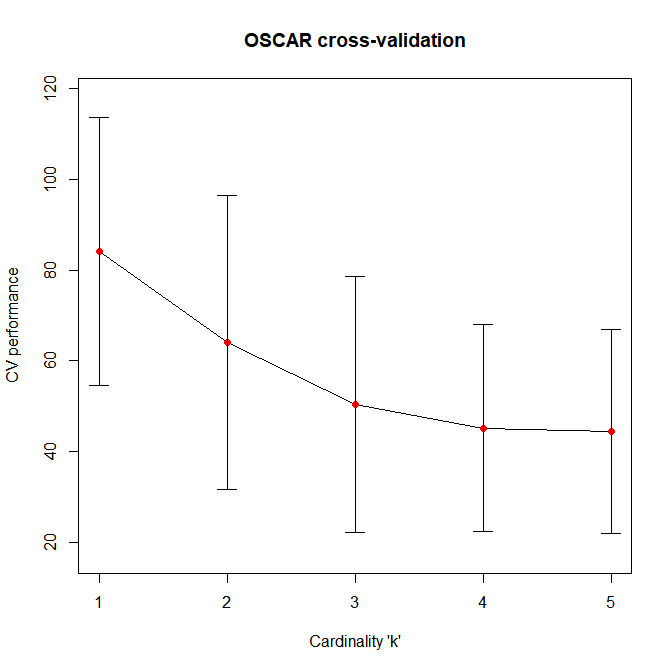

```{r oscar}
library(oscar)
```

```{r echo=FALSE}
# The computationally heavy parts have been precomputed but are reproducible with the presented code
load("example_workspace.RData")
```

# OSCAR modelling

OSCAR (Optimal Subset CArdinality Regression) is an R-package delivering L0-quasinorm penalized regression models for Cox, logistic and gaussian model families. 
It comes with two different optimizers for the computationally demanding optimization task (DBDC and LMBM), and these have been implemented in Fortran.
The R package handles all interaction with Fortran and provides many convenience and visualization functions to assist with L0-penalized regression modelling.
This includes for example cross-validation, bootstrapping, and other diagnostics used to inspect an OSCAR model and assessing importance of features.

Please see Halkola et al. [1] for citing OSCAR. The primary solver for the DC-decomposition transforming the L0-pseudonorm optimization problem from discrete to continuous non-convex space is done via DBDC ('Double Bundle method for nonsmooth DC optimization'), which is described in detail on Joki et al. [2], although an alternate optimization method for larger problems is offered via LMBM ('Limited Memory Bundle Method for large-scale nonsmooth optimization') as described in Haarala et al. [3].

## Cox regression (simulated TYKS real-world PCa data)

A simulated real-world hospital cohort data with patient survival with prostate cancer (PCa) is provided with:
```{r exdata}
data(ex)
ex_X[1:7,1:7]
head(ex_Y)
```

For further details regarding this dataset and its generation, see reference Laajala et at. [4]

One key feature in OSCAR in addition to its L0 norm penalization is its capability to handle variables as groups, or 'kits'. This grouping of variables causes them to be selected (or omitted) together.
In many clinical applications this is often reality; for example, curating initial data for variables together can occur in cases such as:

* A series of laboratory tests (such as a generic blood panel) are run together
* A pre-made small gene panel is run, instead of transcriptome-wide analysis
* Highly correlated values are obtained together

In the example data from Turku University Hospital (TYKS), a series of clinical variables are run together. 
For example a standard blood panel includes red blood cell count, hematocrite, white blood cell count, etc. 
Additionally, single variables can be run separately; a very common single marker for PCa is Prostate-Specific Antigen (PSA).

The kit structure for such variables that can be obtained together are modelled using a kit indicator matrix:
```{r kits}
ex_K[1:7,1:7]
apply(ex_K, MARGIN=1, FUN=sum) # Row indicator sums
apply(ex_K, MARGIN=2, FUN=sum) # Column indicator sums
```

If the kit matrix is a diagonal indicator matrix with dimensions equal to the number of variables, each variable is L0-penalized without any grouping structure.

Further, these kits can be assigned a 'price'. This may be a price literally, or a descriptive value indicating how hard the variable is to obtain. 
With this information, a clinically feasible pareto-front can be constructed, that simultaneously captures modelling generalization as well as clinical applicability.

A cost vector can be provided for the fitting procedure, and a standardized arbitrary unit cost vector is provided in:

```{r cvec}
head(ex_c)
```

OSCAR comes with two different optimizers: 

* DBDC, double bundle DC optimization, which is computationally more demanding but in general results in better optima
* LMBM, which is faster to run, especially with higher count of variables

These are provided to the fitting procedure with ```solver=1``` and ```solver=2``` or with their abbreviations. They have been implemented in Fortran for computational efficiency.

A quick example run of OSCAR with LMBM together with the default kit structure for Cox regression:

```{r coxfit, eval = FALSE}
set.seed(1)
fit <- oscar(x=ex_X, y=ex_Y, k=ex_K, w=ex_c, family="cox", solver="LMBM")
fit
```

A pareto-optimal front provides information on potential optimal saddle points, where model generalization and clinical applicability pair nicely:

```{r pareto, eval=FALSE, dpi=150, fig.width=7, fig.height=7, out.width="100%", fig.cap="Pareto front for the clinical measurements, their total cost and C-index."}
oscar.pareto.visu(fit=fit)
```

```{r echo=FALSE, dpi=150, fig.width=7, fig.height=7, out.width="100%", fig.cap="Pareto front for the clinical measurements, their total cost and C-index."}
knitr::include_graphics("images/fig1_pareto.png")
```

### Goodness of fit vs. model coefficient cost

Model convergence in target function is important, while an another axis can be plotted simultaneously to provide supporting information:

```{r eval=FALSE, dpi=150, fig.width=7, fig.height=7, out.width="100%", fig.cap="Target function value as a function of k."}
oscar.visu(fit, y=c("target", "cost"))
```

```{r echo=FALSE, dpi=150, fig.width=7, fig.height=7, out.width="100%", fig.cap="Target function value as a function of k."}

```

### Cross-validation and bootstrapping

Fit model object can be inspected based on visual diagnostics such as cross-validation and bootstrapping:

```{r eval=FALSE, dpi=150, fig.width=7, fig.height=7, out.width="100%", fig.cap="5-fold cross-validation for optimally generalizable cardinality 'k'"}
# Perform 5-fold cross-validation to find out optimal k
cv <- oscar.cv(fit, fold=5, seed=123, solver=2)
# Visualize model generalization performance as a function of k
oscar.cv.visu(cv)
```

```{r echo=FALSE, dpi=150, fig.width=7, fig.height=7, out.width="100%", fig.cap="5-fold cross-validation for optimally generalizable cardinality 'k'"}

```

It appears that k-values around 5 or above present a shoulder-point saturate the model, with no further coefficients contributing to the model's generalization capability. 

Further, there is some uncertainty as to what order the coefficients should be non-zero, based on bootstrapping:

```{r eval=FALSE, dpi=150, fig.width=7, fig.height=7, out.width="100%", fig.cap="Selected variables over a set of bootstrap runs"}
# Bootstrap original data 20 times (sampling with replacement and refitting)
bs <- oscar.bs(fit, bootstrap=20, seed=234, solver=2)
# Visualize bootstrapped models
oscar.bs.plot(fit=fit, bs=bs, nbins=20)
```

```{r echo=FALSE, dpi=150, fig.width=7, fig.height=7, out.width="100%", fig.cap="Selected variables over a set of bootstrap runs"}

```

Based on the bootstrapping, PSA is a clear winner. Close second candidate for survival prediction is Alkaline Phosphatase (ALP). 
After these single markers the bootstrapping was quite prone to choosing separate kits between immunomarkers and standard bloodwork, with no clear consistent winner.

### Further useful commands

Useful commands for understanding the model and the oscar S4-object:

```{r eval=TRUE}

coef(fit, k=3) # All potential coefficients at cardinality k=3
feat(fit, k=3) # All features chosen at cardinality k=3
cost(fit, k=3) # Kit sum costs at various k cardinalities, here with cardinality k=3

```

## Other model families

While ```oscar```-package was originally designed with biomedical survival data in mind, it naturally supports modelling of non-survival data. Currently, the ```family``` parameter supports logistic regression for binary outcomes, and mse/gaussian/normal for modelling responses that are normally distributed.

### Gaussian regression (swiss-data)

```{r eval=FALSE, dpi=150, fig.width=7, fig.height=7, out.width="100%", fig.cap="Model coefficients as a function of cardinality 'k'."}
# Use example swiss-data for quickness
data(swiss)
fit_swiss <- oscar(x=swiss[,-1], y=swiss[,1], family="mse", print=0, solver=2)

# Plot model coefficients as a function of cardinality k
plot(fit_swiss) 
```

```{r echo=FALSE, dpi=150, fig.width=7, fig.height=7, out.width="100%", fig.cap="Model coefficients as a function of cardinality 'k'."}

```

Similarly bootstrapping and cross-validation:

```{r eval=FALSE, dpi=150, fig.width=7, fig.height=7, out.width="100%", fig.cap="Bootstrapping of Swiss fertility data (Gaussian/MSE)"}
# Bootstrap original data 50 times (sampling with replacement and refitting)
bs_swiss <- oscar.bs(fit_swiss, bootstrap=50, seed=1, solver=2)
# Visualize trajectories of bootstrapped coefficients
oscar.bs.plot(fit=fit_swiss, bs=bs_swiss, nbins=50)
```

```{r echo=FALSE, dpi=150, fig.width=7, fig.height=7, out.width="100%", fig.cap="Bootstrapping of Swiss fertility data (Gaussian/MSE)"}

```

```{r eval=FALSE, dpi=150, fig.width=7, fig.height=7, out.width="100%", fig.cap="10-fold cross-validation for optimally generalizable cardinality 'k'"}
# Perform 5-fold cross-validation to find out optimal k
cv_swiss <- oscar.cv(fit_swiss, fold=10, seed=2, solver=2)
# Visualize model generalization performance as a function of k
oscar.cv.visu(cv_swiss)
```

```{r echo=FALSE, dpi=150, fig.width=7, fig.height=7, out.width="100%", fig.cap="10-fold cross-validation for optimally generalizable cardinality 'k'"}

```


# References

1. Halkola AS, Joki K, Mirtti T, Makela MM, Aittokallio T, Laajala, TD. OSCAR: Optimal subset cardinality regression using the L0-pseudonorm with applications to prognostic modelling of prostate cancer. Accepted.

2. Joki K, Bagirov AM, Karmitsa N, Makela MM, Taheri S. Double Bundle Method for finding Clarke Stationary Points in Nonsmooth DC Programming. SIAM Journal on Optimization. 2018;28(2):1892-1919. \doi{10.1137/16M1115733}

3. Haarala M, Miettinen K, Makela MM. New limited memory bundle method for large-scale nonsmooth optimization. Optimization Methods and Software. 2004;19(6):673-692. \doi{10.1080/10556780410001689225}

4. Laajala TD, Murtojarvi M, Virkki A, Aittokallio T. ePCR: an R-package for survival and time-to-event prediction in advanced prostate cancer, applied to real-world patient cohorts. Bioinformatics. 2018;34(22):3957-3959. \doi{10.1093/bioinformatics/bty477}

# Session info
```{r sesinfo}
sessionInfo()
```
